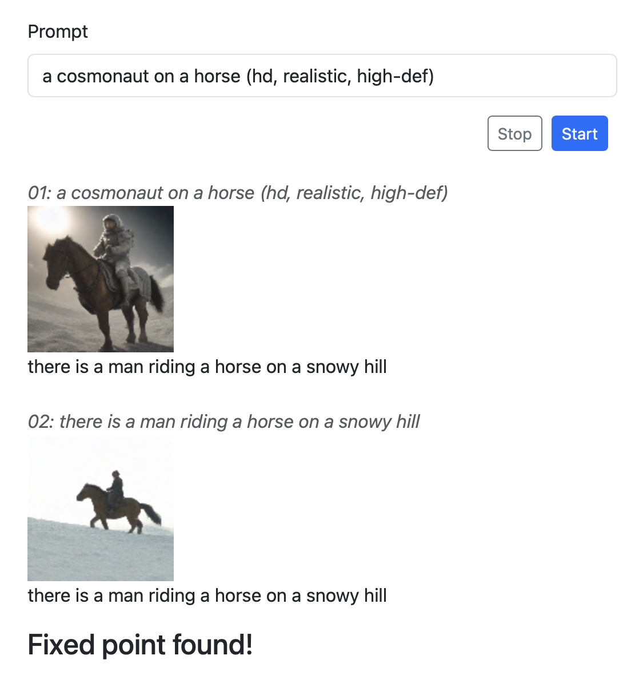

# SD-BLIP Attraction

Take a prompt, generate an image using Stable Diffusion, feed the image into BLIP to generate a description, and use that as a prompt for Stable Diffusion. Repeat this until a BLIP description is produced that has already been seen, or until we reach the maximum number of steps.




## Run on your on hardware

To run, you need the [dioxus cli](https://dioxuslabs.com/learn/0.5/getting_started) (and all its dependencies) installed. Once you have that, you can run the app with:

```bash
dx serve
```
And then connect a web browser to http://localhost:8080.

## Build

To build for distribution, run:

```
dx build --release --platform fullstack
```

The app should be in the `dist` directory, and can be run with:

```
dist/sd-blip-attraction
```

## Hardware Acceleration


I am hoping to allow running with hardware acceleration using Metal on Apple hardware with something like:

```
dx serve --server-feature metal
```

or:

```
dx build --release --platform fullstack --server-feature metal
```

Modifying `Cargo.toml` as described in the comments of the file do allow use of metal, but I have not been able to get it to work by passing the feature flags as command-line arguments.
